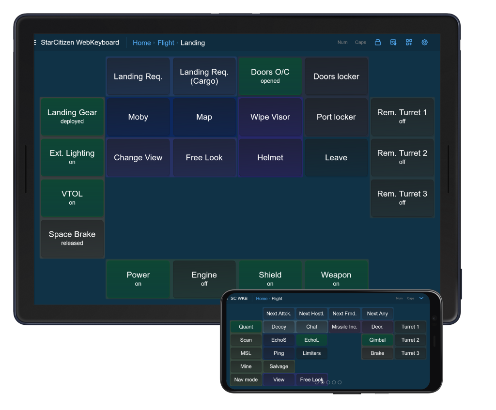

#  WebKeyboard for StarCitizen



The WebKeyboard (WKB) project utilize ESP32S series native USB (also mentions as OTG) interface to emulate custom keyboard 
and joystick controllable by application web interface over wifi. 

> [!NOTE]
> This is an ***unofficial*** companion app for the Star Citizen.

> [!NOTE]
My English is bad, sometimes I also use automatic translation. Edits are welcome. <br/>
All technical details about build, flash or toolchain setup are simplified because it wasn't subject for this page.

- [Description](#description)<br/>
- [Usage](#usage)<br/>
  - [Security](#security)
  - [Configuration](#configuration)
    - [Https](#https)
  - [UI](#ui)
    - [Application settings](#application-Settings)
    - [Keyboard LED Indicators](#keyboard-led-indicators)
    - [Screen Locker](#screen-locker)
    - [Layout Settings](#layout-settings)
    - [Placement mode](#placement-mode)
      - [Select Control](#select-control)
    - [Configuration mode](#configuration-mode)
- [Cost](#cost)<br/>
- [Hardware requirements](#hardware)<br/>
- [Software requirements](#software)<br/>
- [Build](#build)<br/>
- [Firmware Update](#firmware-update)<br/>
- [Status](#status)<br/>
- [Limitation](#limitation)<br/>
- [Dependencies](#dependencies)<br/>

## DESCRIPTION
This is Multi-function display host for StarCitizen. <br/>
Main goal to increase game immersion and bring new life for old devices

Glossary:
- host:       esp32 board
- control:    trigger, game interaction like "deploy landing gear" associated with it state and one or more keyboard combination. Own attributes.
- widget:     axial or radial, associated with some virtual joystick axis or with keyboard combination
- attributes: key/value storage, can be edited in configuration window
- group:      of controls/widgets, behavior is determined by it's type. radiogroup, tag, overlay-group
- page:       container for controls/widgets. 
- layout:     page layout, grid based with (if defined) some number row and col.
- screen:     container for pages, with ability to swipe between pages.
- ref,view:   binding between page and control/widget. Own attributes that inherited from base control/widget attributes. It may have different configuration(from base control) but not different internal state.
- cell:       intersection between grid row and col
- slot:       one or more cell, Anchor for ref(view) at page. Must be rectangular in shape.
- overlay:    more like underlay it highlight neighboring controls/widgets based on their common overlay-group.

Features included: 
- configurable page layout 
- controls/widgets drag&drop placement
- controls/widgets state sync for multiple clients of same host
- controls/widgets grouping
- prebuild controls for many use cases
- control supports the following types of actions upon activation:
  - text typing
  - special key press
  - "long" "short" "double" key press
  - dangling keys
  - activation delegation
- control actions are configurable
- keypress timing randomization
- virtual joystick with 8 axis and 32 buttons
- color overlay for control/widget grouping
- adaptive layout for small screen (to some limit)

## Usage
Main usage of application assume tablet(s) with landscape orientation connected to host via *host wifi hostspot*.
That it, all clients connect to host through same host net. SSID and password are build in and declared in `config.h` file.
After client(s) connected to wifi they can access host main page, by default `wkb.local` or `192.168.5.1` also declared in `config.h`.
When first connected, it is crucial to change wifi password and optionally change ssid and wifi type. 
Make it via [Application settings](#application-Settings). <br>

By default, application "controls" configurated with defaulted game keybinding, and it will work, but for any real usage it is not enough.
There are catch, the game and application both have it's own state, and no way to synchronize it. Instead there are workaround:<br/>
The application control implement two major control archetype: 
- oneshot(trigger): fire and forget associated keybinding
- switch: this one contain state, and it's replicated to other clients.<br/>
  - when it switches from "off" to "on"  `switched-off` combination will fire<br/>
  - when it switches from "on"  to "off" `switched-on`  combination will fire<br/>
    Most game actions have not dedicated switched-on, switched-off operations - they implemented via "oneshot" or not implemented at all.
    Other game action that have dedicated switcher almost always (or just always?) by default use key to rotate state, not set it.
    For that action, dedicated "on" and "off" must be set, and after, application control must-be updated `switched-on`: "off", `switched-off`: "on" yes, inverted.
    Although this is annoying, it allows the state do not lost it sync while you use the app, despite using real joystick or keyboard.<br/>


  *Example game action "landing gear"* <br/>
  *where additional binding are set for Deploy(`ralt+n`) and Retract(`alt+n`).*<br/>

  | `game action` | `switch-on`| `switch-off` | `simplified` |
  |---|---|---|---|
  | `Landing System (Toggle)`  |   `n`   |    `n`    | yes |
  | `Landing System (Deploy)`  |    *    | `ralt+n`  | no  |
  | `Landing System (Retract)` | `alt+n` |     *     | no  |

> [!NOTE]
> The controls type "switch" implement "simplified" mode: when its active and `switched-off` == `switched-on` it's behave like "oneshot" type.
> Mode disabled if any of its requirements not met. It is a way for "switch" to coexist with default game settings.

> [!WARNING]
> Some switch type controls (like missile mode, salvage mode, limiters, turret) transfer control to different page or screen.
> Such feature not work in "simplified" mode. Set up the switches completely to use dedicated mode pages.
> Control within its configuration provide description with explanation tips and hints but also game setting path for every control state.

The application consists of several screens connected by transition buttons.<br/>
Each screen consists of pages, the transition is provided by swiping.<br/>
Each page is a grid with a customizable number of columns and rows.<br/>
The intersection of rows and columns form cells, one or more cells, rectangular in shape, with an assigned identifier form a slot.<br/>
A control/widget can be inserted into such a slot by creating ref(view) to the control/widget.<br/>
Ref(View) can be arbitrarily placed, removed or moved on the page (between slots).<br/>
Ref(View) can overload some or all control/widget attributes, when control is accessed via that ref. But never it's internal state.<br/>
Any changes made from client default state will-be stored in client(device) localStorage and belong to client only.

At the moment, it is impossible to add or remove controls and pages without recompilation.

Application has internal "factory reset trigger" - press "reset", release, wait a moment, press "boot" and hold it for at least second.
If your board have general usage binary led (not addressed led, not supported yet) it will blink few times.
If serial terminal connected it will receive ongoing log and status of operation.  
After "factory reset" all saved host data will-be wiped, default one will-be used.<br/>
Client does not affect by "factory reset" directly. But they can detect it, It will ask the user about a "factory reset" and
if the answer is yes, it will wipe the internal storage of this particular client. This question appear only once.

There are also events that the client will notify the user about:
connection success,
connection error,
new client connected, reconnected, disconnected,
client changed its id,
system factory reset,
host rebooted,
local storage version change,
"system wide" settings change,
page that has been overwritten by the user change(most likely after firmware update) it initial (compiled) state,
client system error,
invalid localStorage data,
device screen too small or incorrectly oriented,
...and more. Some of that event are just notification some require user interaction.

> [!WARNING]
> Invalid ssid, password or wifi type may force host to fall in trap state.
> "factory reset" is only solution, but it will not help it invalid data provided by `config.h`

### Security
The WBK designed to be host for one or multiple client that behave like MFD for ONE user.
So this is single user system. <br/> 
Application have all it's resource build in, and do not require any kind of internet connection to work. <br/>
It have optional ssl webserver with user defined certs, and encrypted wifi connection.<br/>

> [!WARNING]
> Do not use and do not provide internet connection of any kind to application wifi network.</br>
> Do not share network with other device that internet connected, like phones with mobile internet.</br>
> Host in "hotspot mode" more preferable than in STA(Station Mode). Don't connect to host net devices that not host client(display).</br>
> Use encrypted ssl server with your own cert for better security,
> Change password for wifi (and optionally SSID) every factory reset and firmware update (every first enter).</br>
> Remember: every device in network can access host, and host can control your keyboard and joystick, keyboard controls PC</br>
> If PC contain sensitive information do not use application.<br/>
> As precaution usb descriptors also can be changed in `config.h` do it if you know what you doing.<br/>

### Configuration
Default wifi SSID and password defined in `config.h`. <br/>
Most configuration are runtime, rest explained in `config.h`.

#### HTTPS
In order to enable secure http following configuration must be made:<br>
config.h
```
HTTP_USE_HTTPS true
```
put 2- or 3-file certificate inside cert directory, where:
- cert.pem - server certificate in pem format
- privkey.pem - server private key in pem format
- cacert.pem - (optional, presence will be detected) server authority chain in pem format

Files must be readable form user that perform compilation.  

> [!NOTE]
> Certificate acquiring, or cert differences is outside the scope of this topic.

compile with flag:
```
idf.py build -DEMBED_CERT=ON
```

It is recommended to use dns with some domain for application and cert signing that domain.
to enable dns following configuration must be made:<br>
config.h
```
WIFI_MODE           WIFI_MODE_AP
WIFI_AP_DNS         true
WIFI_AP_DNS_CAPTIVE false
```

Handling https is extremely resource consuming for esp32. The following settings are recommended to maintain acceptable 
system responsiveness and prevent resource exhaustion.<br>
config.h
```
SOCKET_RECYCLE_CLOSE_RESOURCE_REQ_VIA_HTTP_HEADER true
SOCKET_RECYCLE_USE_LRU_COUNTER                    true
```

sdkconfig or `idf.py menuconfig`
```
CONFIG_LWIP_MAX_SOCKETS=10
```

> [!Note]
> Server configured to be secure or not secure at compile time. Secured server does not support unsecured connection
> at port 80 and vice versa. If connection error appear, check protocol with what you're connecting to server `http` or `https`
> it can be implicitly changed by the browser

### UI

The main screen of the application consists of a header and content area that takes up most of the device screen.
The content area displays the current screen of the application. <br/> 
The main element of interaction is the "control". The control recognizes `tap`, `doubletap`, and `longtap`. 
The control itself does not respond to multi-touch, but you can interact with multiple controls at the same time.<br>

A typical control reacts as follows: <br/>
`tap`       - activate <br/>
`longtap`   - toggle state without activation <br/>
`doubletap` - not used, in order to remove the activation delay <br/>

There are exception from rule, the control type "memo" it reacts differently:<br/>
`tap`       - activate <br/>
`longtap`   - clear <br/>
`doubletap`/`twofingertap` - set, override <br/>

The secondary control element is widget. This is canvas graphical element that supports multi-touch
as it can handle more than one internal-control element. To interact with widget you must
touch internal-control head and move to place with desired value inside internal-control boundaries. Value will be sync between all widget that bind to same
virtual joystick axis across all clients. 

There are exception from rule, control type "shields" it reacts differently:<br/>
This is legacy widget and subject to change.
Doest not support multiple internal-controls, does not support multi-touch.
Widget activates by tap at selected shield section. Or by hold finger at ship icon for time of
shield collapse animation, and then move finger in direction of desired shield section.
Widget have configurable number of shield section [1-6] + 1 (reset) via configuration mode.

> [!TIP]
> In most modern browsers you can hide the address bar by dragging the page up (via the title or empty space on the page)


Most of the application configuration options are located in its header:


#### Application Settings
> &#9776; StarCitizen WebKeyboard  <br/>

> &#9776; SC WKB

The application main settings (normal and compact view). 
- Wifi settings
  - Mode - WPA version to use
  - SSID - Access point name. at least 7 symbols
  - Password - Access point password, at least 7 symbols
- ClientId - Short name for this client, it will be used to notify other about this client join in. If blank - random be used.
- Haptic Resp. - Toggle vibration response to user interaction (with controls/widgets)
- Overlay - Toggle controls/widgets highlighting based on common overlay-groups

> [!WARNING] 
> Do not use same ClientId on different device. Leave it blank if you're not sure

If Wifi settings change - all client will be notified.

####  Keyboard LED Indicators
> [Num] Caps

Indicate current virtual keyboard led status.
Also triggers, that trigger appropriate control.

####  Screen Locker
> 

When active - Lock current screen at selected page, swipe will be unavailable.
It exists to protect against accidental swipe out, allow precise panning.

####  Layout Settings
> 

Current Page layout settings.
- Columns - (count) of grid
- Rows - (count) of grid
- Cell Gap - spaces between any cell
- In Cell Padding
- Font Size
- Layout - Css { .grid-template-areas } grid mapping, it is text representation of grid{Cols * Rows}.

  Example of page "on-foot" with grid{5*5}
  ```
  ". . . . ."
  ". a b c ."
  ". f g h ."
  ". d d e ."
  ". . . . ."
  ```
  - " - symbol is beginning or end of row 
  - . - empty cell, this place is unreachable for controls/widgets. But it take same size as any other cell.
  - a-z - identifier of slot. One or more english alphabet symbols. <br/> 
    controls/widgets by default are assigned to specific slot
    based on index position inside page. a - 1, b - 2, aa - 27.
    That is, row `". a b c ."` mean "empty first second third empty".
    Default assigment rule require identifier to be monotonically increasing.
  - if identifier repeats vertically or horizontally without interruptions it means col or row span.
    `". d d e ."` d (element with index 4) will be twice longer in x-axis.<br/>
  - Identifier does not belong to a specific controls/widgets.
    The page is possible where 30 cell{5*6} but only 5 mapped slots and only once control, control take first slot.
    But if controls count is more than available slots or identifiers is inconsistent, behavior is undefined and browser specific.
    At least in firefox [Placement mode](#placement-mode) able to remove or move such elements.<br/>
    [More](https://developer.mozilla.org/en-US/docs/Web/CSS/grid-template-areas)
    
- Reset - reset Layout to state where slot counter == cell counter. Creating maximum possible slots.<br/>
  Table from the previous example after reset:
  ```
  "a b c d e"
  "f g h i j"
  "k l m n o"
  "p q r s t"
  "u v w x y"
  ```
- ***<ins>D</ins>efault*** - (button at window toolbar) reset all Layout setting to its prebuilded default, "factory-reset" for page.

####  Placement mode
> 

The Placement mode switcher. Only one mode can be activated at same time.
In this mode, all page controls/widgets are scaled down. All slots highlight their border and display their slots identifier. 
After transition completes, user can add,move,remove controls/widgets from page using tap and longtag.

- tap on slot with existing "control" and then to empty slot to move "control" to that slot.
- tap on slot with existing "control" and then to slot with other "control" to swap it.
- tap on slot with existing "control" and then longtap slot with other "control" to replace second with first one (second will-be removed).
- longtap on slot with existing "control", remove it.
- longtap on empty slot to display [Select Control](#select-control) window.

> [!NOTE]
> There are special buildin recovery mode, if layout broken in some way, if "control" is outside the slot boundaries it still can be moved to valid slot
> or removed. In such case no selection highlight appear.

> [!NOTE]
> The Page is possible with layout that not define any grid. There is no slot and no cell's until you define it by [Layout Settings](#layout-settings)


#####  Select Control

The Window that appear to request from Placement mode. Allow select controls/widgets from prebuild library.
Search by keywords is possible, regexp is supported with explicit syntax `/regExp/`

> [!WARNING]
> Safe handling of custom(user) RegExp requires a certain level of browser API. If API is not available, on such request an error will be returned.


####  Configuration mode
> 

The Configuration mode switcher. Only one mode can be activated at same time.
Mode move controls/widgets in configuration mode. Now when activated configuration window will appear.
Configuration window allow editing attributes both for ref and its parent control/widget.<br/> 

> [!NOTE]
> Ref attributes are inherited from its parent control/widget attributes. So any changes to parent attributes will appear
> in all references(with exceptions desc. next), but any changes to ref attributes are local to that ref. <br/>
> exceptions: <br/>
>  - if ref attributes set value, it's now shadows any and all changes from parent.
>  - some attribute have noniheritable flag, they are member of control/widget internal state and as such this attribute
>    fully transparent and sync between control/widget and all it's refs.

Window form contain two "panels" one for each scope, control/view attributes scope and reference scope.<br/>
Description and it's color on top of window form will help distinguish scope.<br/>
***<ins>S</ins>cope*** button, at window toolbar, changes current scope.

> [!TIP]
> At initial setup, it's good idea use control/widget scope to set keybindings
> as control/widget may appear more than at one page, but keybindings almost never change for same action.

After the scope description, attributes follow. <br/>
All writeable attribute have it's inheritance marker: `inherited`, `owned`, `not inheritable`, it will update automatically.
Attributes with name Keybind([state|<empty>]) represent keyboard combination what will be triggered when widget is activated in such state.
Keybind value have special rules: <br/>
- text inside + brace is key, other is case-sensitive text. <br/>
- text inside + brace, after : is press modifier
- text after "call:", when is a valid ctrl-id, is control activation delegation

Examples: <br/>
- `+ctrl+a` -> press ctl+a
- `+alt+ctrl+del+` -> press alt+ctrl+del
- `+~+Quit+enter+~+` -> open console type Quit press enter close console
- `+x:down+`, `+b:long+` -> keydown key x, long press key b
- `call:ping` -> when this control active, also activate control ping, any deep, but no recursion is allowed

At end of form two special attribute placed: <br/>

Description that contain valuable information about this control/widget. <br/>
It also have links that display in-game settings path for used game actions. <br/>

Groups Tag: List of all groups the control is a member of. The Color are same for overlay color for such group (if it overlay group).

####  Compact/Normal toolbar switcher
> 

That item appears when applications transfer in compact mode by x-axis. 
It's cover all other toolbar items except led indicators. 

## Cost
This software is free. The board itself costs less than $5.
You also need Tablet or Phone and game for sure.

## Hardware

**ESP32S3** with at least 4MB flash memory and dedicated USB OTG on board, preffer (but not required) fullsize devboard with 2 usb - one usb otg and one usb serial(for firmware update)

**ESP32S2** also theoretically support, but totaly untested. You may also have to reconfigure the `sdkconfig` file, for this board.

**ESP01**, **ESP32***, **ESP32C*** **ESP32S1** are not support and probably won't compile.

This application developed and tested on **ESP32-S3-DevKitC-1** **N8R2**, MCU labeled as **ESP32-S3-WROOM-1**.

You also need tablet capable to run browser (see [software requirements](#software)), with (preferable) touch screen and wifi capable - at least wifi-4(IEEE 802.11n).
As alternative - modern phone with big screen was also fine, but WBK only partialy optimize for small high dpi screens, so it might be unpleasant.

This application ~~toasted~~ tested on Tegra 2 tablet.

> [!NOTE]
> Some version of app with specific configuration able to fit inside 2MB flash memory esp32s3

## Software

Firefox at least 52. Small graphical degradation, small to medium performance degradation.

Chrome (and Chromium based)  at least 57.

Safari not tested.

All major current browser must work fine.

This application tested on Tegra 2 tablet with Android 4.0 and firefox52 (last of armv6). Suffer from lack of fps in transition, but functional.<br/>
Not so modern, but still, state-of-the-art phone with chrome136.</br>
Windows and Linux machines with latest chrome and firefox but also with chrome57.</br>

## Build
 - binary files are available under [Release](https://github.com/alh1m1k/WebKeyboard-for-StarCitizen/releases/latest) section. They may lag behind the version in the repository.
 - docker builder(container) not available.

For manual build you need ESP-IDF toolchain version at least 5.5.1 with some modules:
- espressif/esp_tinyusb

But, eventually you need setup working environment to make `ifd.py` available at project root. Select target by `idf.py set-target esp32s3` or `esp32s2`<br/>
Then, with internet available, just type:
`idf.py build .`
All dependencies will be installed, and binary was builded or error occur. 

How setup toolchain read this:

[Windows Toolchain Setup](https://docs.espressif.com/projects/esp-idf/en/stable/esp32/get-started/windows-setup.html) <br/>
[Linux&MacOs Toolchain Setup](https://docs.espressif.com/projects/esp-idf/en/stable/esp32/get-started/linux-macos-setup.html)

## Firmware Update
- no OTA
- you can use any preferable way to upload binary to the board.

For manual upgrade setup toolchain like in [Build](#build) section, connect board for-upload-firmware-usb port (typically labels like "COM" "Serial" "TTL") to pc.
Detect device name for windows using devmgmt.msc (device manager)
for linux obtain by using lsusb device path. When execute:
`idf.py flash device` where `device` is port name like: `COM4` for windows or path like `/dev/ttyACM0` for linux.
When after binary write is complete, it will be useful to check internal logs by using:
`idf.py monitor device`

> [!WARNING]
> There is a specific type of error caused by a successful firmware update. 
> If a certain page changes its prebuilt controls/widgets composition or controls/widgets order during the update,
> and a custom layout other than the default is defined for the page,
> such a layout changes cannot be merged. The user will be prompted to reset
> the layout or use the current one at their own risk.


## Status

The WKB in PREVIEW stage. <br/>
Preview both to test app codebase and determine the need for such application. <br/>
The app will have to compete with macro-keyboards, touch panels, voice-copilots, self-made cockpits and even some services.
Given some limitations and the need for hardware, the question of the necessity of such an application is open.
And I will leave it to its end users.

## Limitation

- No way to sync game state and application state, if you switch master-mode by joystick or keyboard the wkb won't know about it.
  This is why it is crucial to use `set`, `unset` game keybindings instead of `rotate|switch` in application configuration (in game you can use whatever you want).
- Currently virtual joystick doest not support axis value merge from different clients simultaneously.
- Currently host doest not provide information to client about requested key combination completion, or error in usb stack.
- Dangling(always pressed) keys will be unpresed before any other combination executed and then after, pressed again (space brake will be released before deploy gear command send and then deployed again ).
- Currently only one virtual joystick with 8 axis and 32 buttons is implemented.
- Most of social interaction require chat window is enable. As it by default use ```/dance``` style command.
- Combination at maximum can contain 6 keys and 8 modificators, this not apply to textmode.
- Combination that require specific keyboard mode is set, like ```Num``` for ```Num+``` will not resolve automatically, even if it technically possible, you must handle it manualy.
- Any joystick value will not apply until first user interaction with widget that handle joystick appear. This it both bug and safety feature, that prevent incorrect default value apply without user note it.
- Virtual Joystick require calibration before use. 
- Decoy deploy and other client repeat-with-delay control may repeat incorrect number of times.  This one is difficult, it include net delays, keyboard key press timing randomization, and how game handle specific action.
- Key handling native and on WINE may perform differently, for specific combination, why it is mystery for me.
- Currently widget may look creepy. It is initial implementation, it lacking some feature and have some bugs too.
- You will not see "factory reset" led indication if you board use addressable led as generic indicator led.
- Some bugs exist here and there. Caused by the static nature of the memory management inside the LWIP, rudimentary server implementation and legacy partially textual protocol of client-server communication. These are extreme cases (enabling all possible switches, extremely long names) and will remain at least until the next major refactoring of the server.
- Currently client setting belong to that client. While there are probably cases where this is convenient, it most often results in strange behavior from clients with different settings. In the future, there will probably be an explicit or implicit way to synchronize settings.

## Dependencies 
- idf >= 5.5.1
  - espressif/esp_tinyusb >= 0.19.0~2
- main logo created with MockUPhone
